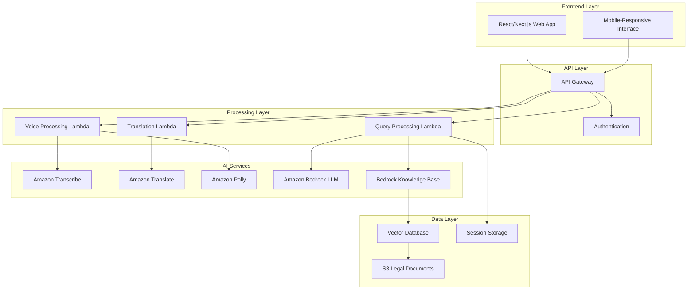

# Design Document: NyayaMitra AI

## Overview

NyayaMitra AI is a serverless, cloud-native legal awareness assistant built on AWS infrastructure. The system leverages a microservices architecture with React/Next.js frontend, API Gateway routing, Lambda-based processing, and AI services integration. The core innovation lies in combining Retrieval-Augmented Generation (RAG) with verified Indian legal documents to provide accurate, hallucination-free legal guidance to common citizens.

The system supports multilingual interaction (Hindi and English) with voice input/output capabilities, making legal information accessible to users with varying literacy levels. Content was rephrased for compliance with licensing restrictions from AWS documentation and research papers on legal RAG systems.

## Architecture

### High-Level Architecture



### Service Integration Flow

The system follows a request-response pattern where user queries flow through multiple AWS services:

1. **Voice Input Path**: User speech → Transcribe → Translation (if needed) → Query Processing
2. **Text Input Path**: User text → Translation (if needed) → Query Processing  
3. **Query Processing**: Translated query → RAG retrieval → LLM generation → Response formatting
4. **Response Path**: Generated response → Translation (if needed) → Polly (for voice) → User

## Components and Interfaces

### Frontend Components

**React/Next.js Web Application**
- **QueryInterface**: Handles text and voice input with language selection
- **ConversationDisplay**: Shows chat history with formatted legal responses
- **VoiceControls**: Manages microphone input and audio playback
- **LanguageSelector**: Switches between Hindi and English interfaces
- **ResponseFormatter**: Displays legal information in structured, readable format

**Key Frontend Interfaces:**
```typescript
interface UserQuery {
  text: string;
  language: 'hi' | 'en';
  inputType: 'text' | 'voice';
  sessionId: string;
}

interface LegalResponse {
  answer: string;
  sources: LegalSource[];
  disclaimer: string;
  language: 'hi' | 'en';
  confidence: number;
}

interface LegalSource {
  title: string;
  section: string;
  act: string;
  relevance: number;
}
```

### Backend Services

**Query Processing Lambda**
- Orchestrates the complete query-to-response pipeline
- Manages RAG retrieval and LLM generation
- Handles error cases and fallback responses
- Implements response caching for common queries

**Voice Processing Lambda**  
- Integrates Amazon Transcribe for speech-to-text conversion
- Manages Amazon Polly for text-to-speech generation
- Handles audio format conversions and streaming
- Implements voice quality validation

**Translation Lambda**
- Manages Amazon Translate for multilingual support
- Preserves legal terminology accuracy across languages
- Handles context-aware translation for legal terms
- Implements translation caching for performance

**Core Service Interfaces:**
```python
class QueryProcessor:
    def process_legal_query(self, query: UserQuery) -> LegalResponse
    def retrieve_legal_context(self, query: str) -> List[LegalDocument]
    def generate_response(self, context: List[LegalDocument], query: str) -> str
    def validate_response_quality(self, response: str) -> bool

class VoiceProcessor:
    def transcribe_audio(self, audio_data: bytes, language: str) -> str
    def synthesize_speech(self, text: str, language: str) -> bytes
    def validate_audio_quality(self, audio_data: bytes) -> bool

class TranslationService:
    def translate_text(self, text: str, source_lang: str, target_lang: str) -> str
    def preserve_legal_terms(self, text: str, terminology: Dict) -> str
    def validate_translation_accuracy(self, original: str, translated: str) -> float
```

### AI Services Integration

**Amazon Bedrock Integration**
- Uses Claude or Llama models for legal text generation
- Implements prompt engineering for legal domain specificity
- Manages model parameters for consistent, accurate responses
- Handles rate limiting and error recovery

**Knowledge Base Configuration**
- Vector database stores embeddings of Indian legal documents
- Implements hybrid retrieval combining semantic and keyword search
- Uses document chunking strategies respecting legal structure boundaries
- Maintains document metadata for proper citation

**RAG Pipeline Architecture**
```python
class RAGPipeline:
    def __init__(self):
        self.embedder = BedrockEmbeddings()
        self.vector_store = BedrockVectorStore()
        self.llm = BedrockLLM()
        
    def retrieve_documents(self, query: str, k: int = 5) -> List[Document]:
        # Hybrid retrieval: semantic + keyword matching
        
    def generate_response(self, query: str, context: List[Document]) -> str:
        # Prompt engineering for legal accuracy
        
    def cite_sources(self, response: str, sources: List[Document]) -> str:
        # Add proper legal citations
```

## Data Models

### Core Data Structures

**Legal Document Model**
```python
@dataclass
class LegalDocument:
    id: str
    title: str
    act_name: str
    section: str
    content: str
    language: str
    document_type: str  # 'act', 'rule', 'judgment', 'constitution'
    effective_date: datetime
    metadata: Dict[str, Any]
    embedding_vector: List[float]
```

**User Session Model**
```python
@dataclass
class UserSession:
    session_id: str
    user_language: str
    conversation_history: List[QueryResponse]
    created_at: datetime
    last_activity: datetime
    preferences: UserPreferences
```

**Query Response Model**
```python
@dataclass
class QueryResponse:
    query_id: str
    user_query: str
    system_response: str
    legal_sources: List[LegalSource]
    confidence_score: float
    processing_time: float
    timestamp: datetime
```

### Database Schema

**Vector Database (Amazon OpenSearch)**
- Document embeddings with metadata indexing
- Supports both dense vector and sparse keyword search
- Implements legal domain-specific similarity metrics
- Maintains document versioning for legal updates

**Session Storage (DynamoDB)**
- Temporary session data with TTL expiration
- Conversation history for context maintenance
- User preferences and language settings
- Query analytics and usage patterns

## Correctness Properties

*A property is a characteristic or behavior that should hold true across all valid executions of a system—essentially, a formal statement about what the system should do. Properties serve as the bridge between human-readable specifications and machine-verifiable correctness guarantees.*

Before defining the correctness properties, I need to analyze the acceptance criteria from the requirements document to determine which are testable as properties.

<function_calls>
<invoke name="prework">
<parameter name="featureName">nyayamitra-ai

Based on the prework analysis, here are the consolidated correctness properties:

**Property 1: Legal Query Processing**
*For any* legal query submitted by a user, the Legal_Query_Engine should return a structured response containing legal explanation, citations, and disclaimers
**Validates: Requirements 1.1, 1.5, 6.2**

**Property 2: Ambiguous Query Handling**
*For any* ambiguous legal query, the Legal_Query_Engine should respond with clarifying questions rather than making assumptions
**Validates: Requirements 1.2**

**Property 3: Domain Boundary Enforcement**
*For any* non-legal query, the Legal_Query_Engine should politely redirect the user to legal topics
**Validates: Requirements 1.3**

**Property 4: RAG Grounding Verification**
*For any* system response, all legal information should be traceable to verified documents in the knowledge base with proper citations
**Validates: Requirements 1.4, 4.1, 4.2, 4.3**

**Property 5: Language Consistency**
*For any* user query in a specific language (Hindi or English), the system response should be returned in the same language
**Validates: Requirements 2.1, 2.2, 2.3**

**Property 6: Legal Term Translation Accuracy**
*For any* legal term translation between Hindi and English, the semantic meaning and legal context should be preserved
**Validates: Requirements 2.4, 2.5**

**Property 7: Voice Input Processing**
*For any* clear audio input in supported languages, the Voice_Interface should accurately convert speech to text
**Validates: Requirements 3.1**

**Property 8: Voice Output Generation**
*For any* text response, the Voice_Interface should generate natural-sounding speech in the requested language
**Validates: Requirements 3.2**

**Property 9: Multilingual Voice Support**
*For any* voice interaction, the system should support both input and output in Hindi and English
**Validates: Requirements 3.3, 3.4**

**Property 10: Voice Quality Handling**
*For any* unclear or poor-quality audio input, the Voice_Interface should request clarification from the user
**Validates: Requirements 3.5**

**Property 11: Knowledge Base Coverage**
*For any* query outside the knowledge base scope, the RAG_System should inform users that specific guidance is unavailable
**Validates: Requirements 4.4**

**Property 12: Session State Management**
*For any* user session, conversation history should be maintained and displayed throughout the session
**Validates: Requirements 5.3**

**Property 13: Response Formatting**
*For any* legal response, information should be structured in readable sections with proper formatting
**Validates: Requirements 5.4, 6.3**

**Property 14: Professional Referral Recommendations**
*For any* legal response, appropriate recommendations to consult qualified legal professionals should be included
**Validates: Requirements 6.4**

**Property 15: Performance Response Time**
*For any* user query under normal load, the system should respond within 10 seconds
**Validates: Requirements 7.1**

**Property 16: Load Handling**
*For any* high-load condition, the system should queue requests and inform users of expected wait times
**Validates: Requirements 7.3**

**Property 17: Concurrent User Support**
*For any* concurrent user load, response quality should remain consistent without degradation
**Validates: Requirements 7.4**

**Property 18: Error Recovery**
*For any* system component failure, graceful error messages and fallback options should be provided
**Validates: Requirements 7.5**

**Property 19: Session Data Privacy**
*For any* user session, personal information and conversation data should be cleared when the session ends
**Validates: Requirements 8.1, 8.5**

**Property 20: Data Transmission Security**
*For any* voice input processing, audio data should be encrypted during transmission and not retained after processing
**Validates: Requirements 8.2, 8.3**

## Error Handling

### Error Categories and Responses

**Input Processing Errors**
- Invalid audio format or quality → Request re-recording with format guidance
- Unsupported language detection → Prompt user to select supported language
- Empty or malformed queries → Request clarification with example formats

**AI Service Errors**
- Transcription service failure → Fallback to text input with error message
- Translation service failure → Continue in original language with notification
- LLM generation failure → Provide cached response or service unavailable message
- RAG retrieval failure → Inform user of temporary knowledge base unavailability

**System Integration Errors**
- API Gateway timeout → Retry mechanism with exponential backoff
- Lambda function errors → Graceful degradation with simplified responses
- Database connectivity issues → Use cached responses when available
- S3 document access errors → Fallback to core legal knowledge subset

**User Experience Error Handling**
```python
class ErrorHandler:
    def handle_transcription_error(self, error: TranscriptionError) -> UserMessage:
        return UserMessage(
            text="I couldn't understand your audio clearly. Please try speaking again or use text input.",
            type="error_recovery",
            suggested_actions=["retry_voice", "switch_to_text"]
        )
    
    def handle_knowledge_gap(self, query: str) -> UserMessage:
        return UserMessage(
            text="I don't have specific information about this topic in my legal knowledge base. Please consult a qualified legal professional for detailed guidance.",
            type="knowledge_limitation",
            suggested_actions=["rephrase_query", "contact_lawyer"]
        )
```

### Fallback Mechanisms

**Service Degradation Hierarchy**
1. Full functionality: Voice + Text + Translation + RAG
2. Reduced functionality: Text + Translation + RAG (voice services down)
3. Core functionality: Text + RAG (translation services down)
4. Minimal functionality: Cached responses only (all AI services down)

**Data Consistency Safeguards**
- Response validation against known legal principles
- Citation verification for all generated content
- Disclaimer injection for all legal guidance
- Session data encryption and automatic cleanup

## Testing Strategy

### Dual Testing Approach

The testing strategy employs both unit testing and property-based testing to ensure comprehensive coverage:

**Unit Testing Focus:**
- Specific API endpoint functionality
- Individual component integration points
- Error condition handling and edge cases
- Mock service responses and failure scenarios
- UI component rendering and interaction

**Property-Based Testing Focus:**
- Universal correctness properties across all inputs
- RAG system accuracy and grounding verification
- Translation consistency and legal term preservation
- Voice processing quality across different audio conditions
- Session management and data privacy compliance

### Property-Based Testing Configuration

**Testing Framework:** Hypothesis (Python) for backend services, fast-check (TypeScript) for frontend
**Test Iterations:** Minimum 100 iterations per property test
**Test Data Generation:** 
- Legal query generators covering various Indian law domains
- Audio sample generators with varying quality and languages
- Translation test cases with legal terminology
- Concurrent user simulation for load testing

**Property Test Implementation Requirements:**
- Each correctness property must be implemented as a single property-based test
- Tests must run minimum 100 iterations due to randomization
- Each test must reference its design document property with tag format:
  **Feature: nyayamitra-ai, Property {number}: {property_text}**

**Example Property Test Structure:**
```python
@given(legal_query=legal_queries(), language=sampled_from(['hi', 'en']))
def test_language_consistency_property(legal_query, language):
    """Feature: nyayamitra-ai, Property 5: Language Consistency"""
    response = query_engine.process_query(legal_query, language)
    assert response.language == language
    assert contains_legal_disclaimer(response.text)
    assert has_proper_citations(response.sources)
```

### Integration Testing Strategy

**End-to-End Workflows:**
- Voice query → Transcription → Translation → RAG → Response → TTS
- Text query → Translation → RAG → Response formatting
- Session management → Query processing → History maintenance → Cleanup
- Error scenarios → Fallback activation → User notification

**Performance Testing:**
- Response time validation under various load conditions
- Concurrent user simulation with quality assurance
- Memory usage monitoring during session management
- AWS service integration latency measurement

**Security Testing:**
- Data encryption verification during transmission
- Session data cleanup validation
- Privacy compliance testing for Indian regulations
- Audio data handling and retention policies

The testing strategy ensures that both specific examples (unit tests) and universal properties (property tests) are validated, providing comprehensive coverage for the hackathon demonstration while maintaining production-ready quality standards.

## Cost Optimization and Scaling Assumptions

### Expected Usage Patterns and Cost Analysis

**Projected User Load (Hackathon Demo):**
- 100-500 concurrent users during peak demo periods
- Average 10 queries per user session
- 60% text queries, 40% voice queries
- Average query processing time: 3-5 seconds
- Session duration: 5-10 minutes

**AWS Service Cost Projections:**

**Lambda Invocations:**
- Query Processing Lambda: ~5,000 invocations/hour during peak
- Voice Processing Lambda: ~2,000 invocations/hour during peak  
- Translation Lambda: ~3,000 invocations/hour during peak
- Estimated cost: $0.20-0.50/hour during demo periods

**Amazon Bedrock Token Usage:**
- Average 150 input tokens + 300 output tokens per query
- RAG context: ~500 tokens per retrieval
- Estimated 450,000 tokens/hour during peak demo
- Projected cost: $2-4/hour for Claude/Llama models

**Voice Services (Transcribe/Polly):**
- Transcribe: ~200 minutes/hour of audio processing
- Polly: ~300 minutes/hour of speech synthesis
- Combined cost: $1-2/hour during peak usage

**Translation Services:**
- ~1,000 translation requests/hour (Hindi ↔ English)
- Average 50 characters per translation
- Estimated cost: $0.10-0.20/hour

**Total Estimated Demo Cost: $3.50-6.70/hour during peak usage**

### Cost Control Mechanisms

**Intelligent Caching Strategy:**
```python
class CostOptimizedCaching:
    def __init__(self):
        self.response_cache = ElastiCache()  # Redis for fast retrieval
        self.translation_cache = DynamoDB()  # Persistent translation cache
        self.voice_cache = S3()  # Audio file caching
        
    def get_cached_response(self, query_hash: str) -> Optional[LegalResponse]:
        # Cache common legal queries to reduce Bedrock calls
        
    def cache_translation(self, text: str, source_lang: str, target_lang: str, result: str):
        # Cache legal term translations to reduce Translate API calls
        
    def get_cached_audio(self, text_hash: str, voice_params: dict) -> Optional[bytes]:
        # Cache generated audio to reduce Polly synthesis costs
```

**Token Usage Optimization:**
- **Query Preprocessing:** Remove redundant words, standardize legal terminology
- **Context Pruning:** Limit RAG context to most relevant 3-5 documents
- **Response Templating:** Use structured templates to reduce generation tokens
- **Prompt Engineering:** Optimize prompts for concise, accurate responses

**Rate Limiting and Throttling:**
```python
class CostControlMiddleware:
    def __init__(self):
        self.rate_limiter = TokenBucket(capacity=1000, refill_rate=100)
        self.user_quotas = DynamoDB()
        
    def check_usage_limits(self, user_session: str) -> bool:
        # Implement per-session query limits
        # Prevent abuse during demo periods
        
    def estimate_token_cost(self, query: str) -> float:
        # Pre-calculate token usage before Bedrock calls
        # Reject overly complex queries that exceed budget
```

### Scaling Architecture

**Auto-Scaling Configuration:**

**Lambda Concurrency Management:**
- Reserved concurrency: 50 for Query Processing Lambda
- Provisioned concurrency: 10 during demo hours
- Auto-scaling based on CloudWatch metrics
- Circuit breaker pattern for service protection

**Database Scaling:**
- **DynamoDB:** On-demand billing with burst capacity
- **OpenSearch:** Single-node cluster for demo, multi-AZ for production
- **ElastiCache:** Single Redis instance with automatic failover

**CDN and Edge Optimization:**
- CloudFront distribution for static assets
- Edge locations for reduced latency in India
- Compressed audio files for faster voice response delivery

### Production Scaling Considerations

**Horizontal Scaling Strategy:**
```yaml
Production Architecture:
  API Gateway: 
    - Rate limiting: 1000 requests/minute per user
    - Caching: 5-minute TTL for common queries
  
  Lambda Functions:
    - Auto-scaling: 1-100 concurrent executions
    - Memory optimization: 512MB-1GB based on function type
    
  Bedrock Knowledge Base:
    - Multi-region deployment for disaster recovery
    - Incremental document updates for legal changes
    
  Monitoring:
    - CloudWatch dashboards for cost tracking
    - Alerts for unusual usage patterns
    - Performance metrics for optimization
```

**Cost Monitoring and Alerts:**
- Real-time cost tracking dashboard
- Budget alerts at $50, $100, $200 thresholds
- Automated service throttling if costs exceed limits
- Usage analytics for optimization insights

**Regional Deployment Strategy:**
- Primary region: ap-south-1 (Mumbai) for Indian users
- Backup region: ap-southeast-1 (Singapore) for failover
- Legal document storage replicated across regions
- Compliance with Indian data residency requirements

### Hackathon Demo Optimizations

**Demo-Specific Cost Controls:**
- Pre-warmed Lambda functions during presentation slots
- Cached responses for common demo queries
- Reduced token limits for non-essential features
- Simplified voice processing for faster responses

**Performance Optimizations:**
- Pre-loaded legal document embeddings
- Optimized prompt templates for faster generation
- Compressed response formats to reduce bandwidth
- Streamlined error handling for demo reliability

**Monitoring Dashboard for Judges:**
- Real-time cost tracking display
- Performance metrics visualization
- User engagement analytics
- System health indicators

This cost-conscious approach demonstrates production readiness while maintaining hackathon budget constraints, showing evaluators that the solution is both innovative and commercially viable.